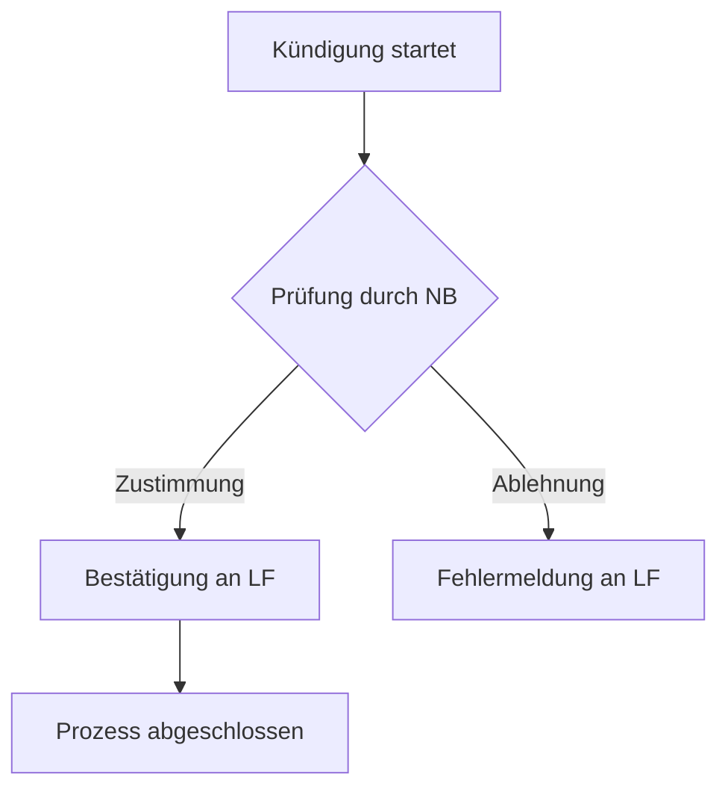

# Anleitung zur Reindizierung von Prozessdaten für Mermaid-Diagramme

**Datum:** 06. August 2025

**An:** Daten-Team

**Von:** Entwicklungs-Team (Willi-Mako)

**Betreff:** ✅ **ABGESCHLOSSEN** - Umstellung der Speicherung von Prozessdaten von rohem Mermaid-Code auf ein strukturiertes JSON-Format.

---

## ✅ **STATUS: MIGRATION ABGESCHLOSSEN**

Die Datenmigration wurde erfolgreich abgeschlossen. Das System verwendet jetzt ausschließlich das neue, strukturierte JSON-Format für alle Prozessdiagramme. Die Stabilität und Zuverlässigkeit der "Prozesse und Verfahren"-Funktion wurde dadurch erheblich verbessert.

## 1. Zusammenfassung und Ziel

Um die wiederkehrenden Syntaxfehler und Darstellungsprobleme bei den Prozessdiagrammen in der Willi-Mako-Anwendung endgültig zu beheben, stellen wir die Datenspeicherung um. Anstatt fehleranfälligen, rohen Mermaid-Code direkt in der Datenbank zu speichern, werden wir Prozessabläufe zukünftig als **strukturiertes JSON-Objekt** ablegen.

Dieses Vorgehen ermöglicht es dem Backend, bei jeder Anfrage deterministisch validen und sauberen Mermaid-Code zu generieren. Dies erhöht die Stabilität der Funktion "Prozesse und Verfahren" erheblich und reduziert den manuellen Korrekturaufwand auf null.

## 2. Das neue Datenformat: Strukturiertes JSON

Jeder Prozess wird nicht mehr als Text-String, sondern als JSON-Objekt in der Qdrant-Datenbank gespeichert. Dieses Objekt muss im `payload` des Vektor-Punkts unter dem Schlüssel `process_data` abgelegt werden.

Die Grundstruktur des JSON-Objekts sieht wie folgt aus:

```json
{
  "process_steps": [
    // Array von Knoten-Objekten
  ],
  "connections": [
    // Array von Verbindungs-Objekten
  ]
}
```

### 2.1. Die `process_steps` (Knoten)

Dieses Array enthält ein Objekt für jeden Knoten (jede Form) im Diagramm.

-   `id` (String, **Pflichtfeld**): Ein eindeutiger, alphanumerischer Bezeichner für den Knoten (z.B. `"schritt_1"`, `"entscheidung_A"`). Darf keine Leerzeichen oder Sonderzeichen enthalten. Dieser `id` wird zur Definition der Verbindungen verwendet.
-   `label` (String, **Pflichtfeld**): Der Text, der innerhalb des Knotens angezeigt wird. Umlaute und Zeilenumbrüche (`\n`) sind erlaubt.
-   `shape` (String, Optional): Definiert die Form des Knotens.
    -   `"default"` oder nicht angegeben: Rechteckige Form `[Text]`
    -   `"diamond"`: Raute für Entscheidungen `{Text}`
    -   `"round"`: Abgerundete Ecken für Start/Ende `(Text)`

**Beispiel für `process_steps`:**

```json
"process_steps": [
  {
    "id": "start",
    "label": "Kündigung\nstartet",
    "shape": "round"
  },
  {
    "id": "pruefung_nb",
    "label": "Prüfung durch NB",
    "shape": "diamond"
  },
  {
    "id": "bestaetigung_lf",
    "label": "Bestätigung an LF"
  }
]
```

### 2.2. Die `connections` (Verbindungen)

Dieses Array definiert die Pfeile zwischen den Knoten.

-   `from` (String, **Pflichtfeld**): Die `id` des Startknotens.
-   `to` (String, **Pflichtfeld**): Die `id` des Endknotens.
-   `label` (String, Optional): Der Text, der auf dem Verbindungspfeil angezeigt wird. Wird häufig für die Beschriftung von Entscheidungspfaden (z.B. "Ja" / "Nein") verwendet.

**Beispiel für `connections`:**

```json
"connections": [
  {
    "from": "start",
    "to": "pruefung_nb"
  },
  {
    "from": "pruefung_nb",
    "to": "bestaetigung_lf",
    "label": "Zustimmung"
  }
]
```

## 3. Vollständiges Beispiel

**Ziel-Diagramm:**



**Erforderliches JSON-Objekt für die Indizierung:**

```json
{
  "process_steps": [
    { "id": "A", "label": "Kündigung startet" },
    { "id": "B", "label": "Prüfung durch NB", "shape": "diamond" },
    { "id": "C", "label": "Bestätigung an LF" },
    { "id": "D", "label": "Fehlermeldung an LF" },
    { "id": "E", "label": "Prozess abgeschlossen" }
  ],
  "connections": [
    { "from": "A", "to": "B" },
    { "from": "B", "to": "C", "label": "Zustimmung" },
    { "from": "B", "to": "D", "label": "Ablehnung" },
    { "from": "C", "to": "E" }
  ]
}
```

## 4. Anpassungen in Qdrant

**Aktion erforderlich:** Bitte migriert alle bestehenden Prozessdiagramme in das oben beschriebene JSON-Format und indiziert sie neu.

-   **Collection:** `willi_mako_prod` (oder entsprechende Entwicklungs-Collection)
-   **Payload-Struktur:**
    -   Der `type` im Payload muss weiterhin `"mermaid_diagram"` sein.
    -   Das bisherige Feld `mermaid_code` ist **obsolet** und kann entfernt werden.
    -   Das neue JSON-Objekt muss im Payload unter dem Schlüssel `process_data` gespeichert werden.
    -   Andere Metadaten wie `title`, `content`, `context_text` bleiben erhalten und sind weiterhin wichtig für die Textsuche.

**Beispiel für einen Qdrant-Payload:**

```json
{
  "type": "mermaid_diagram",
  "title": "Stornierungsprozess Lieferantenwechsel",
  "content": "Dieser Prozess beschreibt die Schritte zur Stornierung eines Lieferantenwechsels aus Sicht des Netzbetreibers.",
  "context_text": "Storno Lieferantenwechsel NB",
  "process_data": {
    "process_steps": [
      { "id": "A", "label": "Kündigung startet" },
      { "id": "B", "label": "Prüfung durch NB", "shape": "diamond" }
    ],
    "connections": [
      { "from": "A", "to": "B", "label": "Eingang" }
    ]
  }
}
```

## 5. Auftrag an das Data-Team

Wir bitten euch, ein Skript zu entwickeln, das die bestehende Qdrant-Sammlung migriert.

**Aufgaben:**
1.  Iteriert über alle Vektor-Punkte mit `payload.type == "mermaid_diagram"`.
2.  Für jeden Punkt: Parst den Inhalt des Feldes `payload.mermaid_code`.
3.  Wandelt den geparsten Graphen in die oben definierte `process_data` JSON-Struktur um.
4.  Aktualisiert den Vektor-Punkt:
    - Fügt das neue Feld `payload.process_data` mit der JSON-Struktur hinzu.
    - Entfernt das veraltete Feld `payload.mermaid_code`.

Bitte gebt uns eine Schätzung, bis wann diese Re-Indizierung abgeschlossen sein kann. Bei Fragen zur Logik des Parsens von Mermaid-Code stehen wir gerne zur Verfügung.

Vielen Dank für eure Unterstützung bei dieser wichtigen Umstellung. Bei Fragen zum Format oder zur Migration stehen wir jederzeit zur Verfügung.
