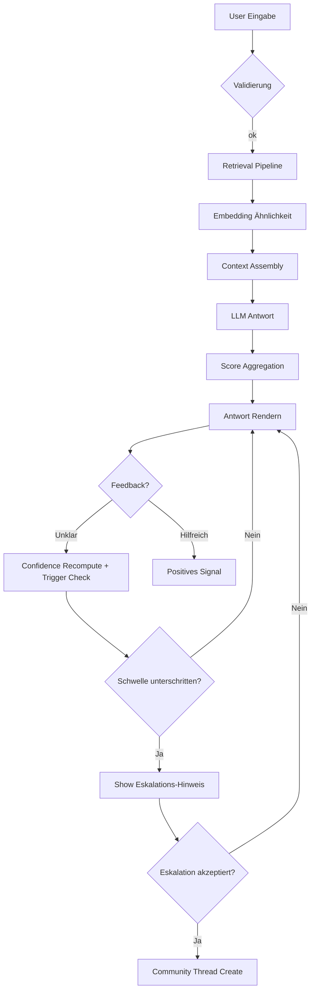

# Chat Flow & Confidence Integration Dokumentation

Version: 1.0  
Datum: 2025-08-09  
Status: Entwurf (Grundlage für Community Hub Eskalations-Trigger)

## 1. Ziel & Nutzen
Diese Dokumentation beschreibt den technischen und funktionalen Ablauf des bestehenden Chat-Systems mit Fokus auf die Einführung eines **Confidence Scores** und definierter **Eskalations-Trigger** für den Community Hub. Besonderheit: Aktuell geringe reale Nutzeraktivität → Kalibrierung primär über synthetische / interne Sessions.

## 2. Scope
In Scope:
- State Machine Chat Request → Antwort → Feedback
- Confidence Score Inputs, Berechnung, Schwellen
- Ereignis (Event) Contract / Telemetrie
- Datenselektion für Community Thread Vorbefüllung
- Strategien bei geringer Datenbasis

Out of Scope:
- Vollständige LLM Prompt Definition
- Rechte- & Rollenmodell (separat im CR)

## 3. High-Level Flow


## 4. Zustände (State Machine)
| State | Beschreibung | Entry Event | Exit Condition |
|-------|--------------|-------------|----------------|
| idle | Kein aktiver Request | init | User input |
| processing | LLM / Retrieval läuft | chat.request.created | Antwort oder Fehler |
| answered | Antwort verfügbar | chat.answer.generated | Feedback / neue Frage |
| low_conf_suggest | Hinweis sichtbar | chat.escalation.recommended | User dismiss / escalate |
| escalating | Thread wird erstellt | chat.escalation.accepted | Erfolg / Fehler |
| escalated | Community Thread Link aktiv | community.thread.created | Neue Chat Frage |

## 5. Confidence Score
### 5.1 Inputs
| Key | Quelle | Normalisierung | Bemerkung |
|-----|--------|----------------|-----------|
| retrieval_relevance | Mean Top-k cosine (k=3) | [0,1] clamp | 1 = hohe Ähnlichkeit |
| faq_match_strength | Beste FAQ Ähnlichkeit | [0,1] | Falls kein Treffer → 0 |
| llm_self_eval | LLM Reflexions-Tag (z.B. "confidence":0.0–1.0) | [0,1] | Prompt Anreicherung nötig |
| answer_density | Tokens mit fachlichem Signal / Gesamt | [0,1] | Stoppwort-Filter |
| rephrase_penalty | # semantischer Rephrases | [0,1] invert | >3 → 0.0 |

### 5.2 Formel (Start-Hypothese)
```
base = 0.35*retrieval_relevance + 0.20*faq_match_strength + 0.25*llm_self_eval + 0.20*answer_density
penalized = base * (1 - 0.15*rephrase_penalty)
confidence = round(penalized,3)
```

### 5.3 Schwellen (Iteration 0)
| Bereich | Label | UI Verhalten |
|---------|-------|--------------|
| >=0.70 | high | Keine Aktion |
| 0.50–0.69 | medium | Passiver Hinweis Icon (Tooltip) |
| <0.50 | low | Aktiver Eskalations-Call-to-Action |

### 5.4 Guardrails
- Mindestens 1 Antwort + 1 Nutzerfeedback oder 2 Antworten ohne Lösung bevor aktiver CTA erscheint.
- Kein `low` bei Antwort < 50 Tokens (wartet auf Next Turn) → Flag `confidence_deferred=true`.

## 6. Event Contract
| Event Name | Zeitpunkt | Pflichtfelder | Optionale Felder |
|------------|-----------|---------------|------------------|
| chat.request.created | Nach Input Parsing | chat_id, user_id, message_id, ts | tokens_estimate |
| chat.retrieval.completed | Nach Retrieval | chat_id, k, avg_similarity | top_ids[] |
| chat.answer.generated | Antwort fertig | chat_id, message_id, confidence, latency_ms | sources[], model, tokens_in, tokens_out |
| chat.answer.feedback | User Feedback | chat_id, message_id, feedback_type | free_text |
| chat.escalation.recommended | Schwelle unterschritten | chat_id, reason (low_conf|loop|pattern), confidence_snapshot | rephrase_count |
| chat.escalation.accepted | User akzeptiert | chat_id, thread_id, trigger_reason | confidence_snapshot |
| community.thread.prefill | Prefill fertig | thread_id, chars_problem, chars_context | masked_entities_count |

Format: JSON Lines Log & optional Message Bus (später). Zeitstempel ISO8601 mit ms.

## 7. Prefill Datenextraktion
| Feld | Extraktion | Fallback |
|------|------------|----------|
| title | Kürzung letzte User-Frage (<=80 chars) | "Offene Frage" |
| problem_description | Letzte User-Frage + konsolidierte Differenz zu Vorfragen | Nur letzte Frage |
| context | Top 2 Retrieval Snippets (≥0.55) Truncation 500 chars | Leer |
| attempted_solutions | AI Antworten → TL;DR je ≤160 chars | Leer |
| detected_entities (maskiert) | Regex (EIC, Zählpunkt, Kundennummer) | [] |

Maskierung: Replace Pattern mit Token `EIC_XXXX`, `ZP_XXXX` (Hash-Last4). Hash: sha1→Base36 first 4.

## 8. Architektur Komponenten (Confidence Layer)
| Komponente | Aufgabe |
|-----------|---------|
| RetrievalService | Liefert Dokumente + Similarity Scores |
| AnswerGenerator | Fragt LLM an + optional Self-Eval Prompt Append |
| ConfidenceAggregator | Nimmt Inputs, berechnet Score, validiert Guardrails |
| EscalationAdvisor | Entscheidet Trigger + liefert Grund |
| PrefillBuilder | Transformiert Chat Slice → Thread JSON |
| MaskingUtility | Ersetzt sensible Tokens |

## 9. Geringe Datenbasis – Kalibrierungsstrategie
| Herausforderung | Lösung |
|-----------------|--------|
| Wenige Real-Dialoge | Generiere synthetische Szenarien (Skripte) mit kontrollierter Varianz |
| Fehlende Ground Truth Confidence | Manuelle Annotation durch 2 interne Reviewer (Likert 1–5) → Mapping auf 0–1 |
| Overfitting an synthetischen Mustern | Mischung: 60% synthetisch / 40% echte Logs sobald verfügbar |
| Fehlalarme schwer erkennbar | Tag `user_feedback=helpful` nach initial `low` → False Positive Ratio |

Iteration Plan:
1. 30 synthetische Chats, Score berechnen → Scatter Plot vs. Manual Ratings
2. Schwellen justieren (ROC Heuristik: Maximierung TPR bei akzeptabler FPR  <25%)
3. Deployment mit Telemetrie Flag `confidence_calibration_phase=true`
4. Nach 2 Wochen: Review Score Drift & Anpassung Gewichte

## 10. Edge Cases & Fallbacks
| Case | Verhalten |
|------|-----------|
| Retrieval leer | Set `retrieval_relevance=0`; Confidence nur aus übrigen Inputs |
| LLM Self-Eval fehlt | Gewicht re-normalisieren ohne self_eval |
| Antwort Timeout | Event `chat.answer.error` + kein Confidence; keine Eskalation automatisch |
| Multi-Turn Long Session | Prefill begrenzt letzte 5 User + 5 Assistant Messages |
| Nutzer löscht letzte Frage | Snapshot invalide → Prefill neu erzeugen bei Eskalation |

## 11. Observability & KPIs (Phase 0)
Messung auch bei geringer Nutzung – Fokus auf qualitative Signale.
| KPI | Ziel (Initial) | Quelle |
|-----|----------------|-------|
| avg_confidence | Tracking (Baseline) | answer.generated |
| low_conf_rate | < 40% | answer.generated |
| escalation_accept_rate | 30–60% der empfohlenen | escalation.* |
| false_positive_rate | < 25% | low→helpful Feedback |

## 12. Implementierungs-Reihenfolge
1. Events & Logging (No UI Änderungen)
2. ConfidenceAggregator + simple Weights
3. Self-Eval Prompt Erweiterung (optional)
4. EscalationAdvisor → Dummy UI Badge
5. PrefillBuilder + MaskingUtility (CLI/Test Harness)
6. One-Click Thread Creation (deaktiviert hinter Flag)
7. Aktivierung UI Indikator (medium / low)

## 13. Teststrategie
| Testtyp | Fokus |
|---------|-------|
| Unit | Score Berechnung, Masking Regex |
| Snapshot | Prefill JSON Struktur |
| Synthetic Integration | End-to-End Chat → Low Confidence → Eskalations-Event |
| Performance | Antwort-Latenz Overhead < 30ms für Aggregator |
| Security | Keine sensiblen Muster unmaskiert in `prefill` Event |

## 14. Offene Fragen
| Thema | Frage | Nächster Schritt |
|-------|-------|-----------------|
| Self-Eval Qualität | Liefert Modell robuste Confidence? | A/B mit / ohne Self-Eval 10 synthetische Fälle |
| Gewichtung Answer Density | Rauschanfällig? | Variance Analyse über 30 Fälle |
| User Dismiss Tracking | Speichern nötig? | Entscheidung PO: Telemetrie-Wert? |

## 15. Anhang: Beispiel Log Events
```json
{"event":"chat.answer.generated","chat_id":"c1","message_id":"m9","confidence":0.47,"sources":[{"id":"faq_12","sim":0.61}],"latency_ms":1420}
{"event":"chat.escalation.recommended","chat_id":"c1","reason":"low_conf","confidence_snapshot":0.47,"rephrase_count":2}
{"event":"chat.escalation.accepted","chat_id":"c1","thread_id":"th_123","trigger_reason":"low_conf","confidence_snapshot":0.47}
```

---
**Fazit:** Die vorliegende Struktur erlaubt sofortige Implementierung der Confidence- & Eskalationslogik trotz geringer Nutzerzahlen und schafft belastbare Grundlage für spätere datengetriebene Feinjustierung.
