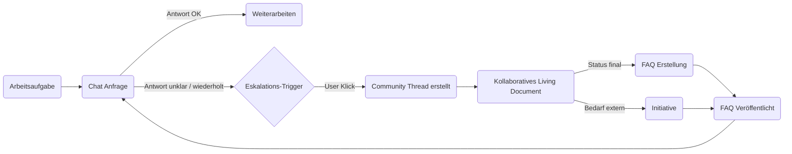

# Customer Journey: Community Hub (Living Document & Kollaborative Eskalation)

Version: 1.0  
Datum: 2025-08-09  
Zweck: Entscheidungs- & Freigabedokument für Product Owner (Legacy-App) zur Einführung des Community Hub Moduls.

---
## 1. Persona & Ausgangslage
**Persona:** "Sachbearbeiter Marktkommunikation" (Primärnutzer)
- Erfahrung: 1–3 Jahre, solide Routine in Standardprozessen (z.B. Stammdatenänderungen, Lieferantenwechsel), aber Lücken in Spezialfällen / Sonderprozessen / Regulatorik-Updates.
- Arbeitsumfeld: Ticket-/Aufgabenschlange, hoher Durchsatzdruck, parallele Tools (EDIFACT-Viewer, CRM, Excel, E-Mail, Willi-Chat). 
- Motivation: Vorgang abschließen, Durchlaufzeit niedrig halten, Fehler vermeiden.
- Frustmomente: Unklare Fehlermeldungen, seltene Sonderprozesse, variierende Interpretationen regulatorischer Vorgaben.

**Sekundäre Personas:**
- Admin / Wissensmanager: Qualitäts­sicherung & FAQ-Pflege
- Fachexperte anderer EVUs: Kollaborative Ergänzung / Peer Review
- Product Owner: Sicherstellen, dass neue Funktion Mehrwert & Adoption bringt ohne Kern-Workflow zu stören

**Trigger-Situation:** Nutzer stockt im Chat bei einem konkreten Problem; wiederholte Nachfragen liefern keine zufriedenstellende, kontextspezifische Lösung.

---
## 2. Zielbild der Journey
Der Nutzer wechselt nicht in ein *anderes Tool*, sondern erweitert seinen Lösungsraum: Chat → (One-Click) Community Hub → Rückfluss in offizielle Wissensbasis (FAQ) → Nachhaltiger Nutzen für alle.

Diagramm (High-Level Flow):


---
## 3. Journey Phasen (Detail)
| Phase | Nutzerziel | Emotion | Schlüssel-Interaktionen | Systemaktionen | Erfolgskriterium |
|-------|------------|---------|-------------------------|---------------|------------------|
| 1. Routine Bearbeitung | Vorgang abschließen | Neutral | Chat Frage stellen | Antwort generieren | Antwort relevant & ausreichend |
| 2. Friktion / Stocken | Problem lösen | Leichte Frustration | Weitere Chat-Prompts, Markierung "Unklar" | Confidence Monitoring, Trigger-Bewertung | Eskalationsoption sichtbar & plausibel |
| 3. Eskalation vorbereiten | Aufwand minimieren | Erleichterung (Option) | Klick "In Community analysieren" | Vorbefüllung generieren (LLM + Scrubbing) | Preview wirkt vollständig (kein Leeres Formular) |
| 4. Thread Erstellung | Start kollaborieren | Fokussiert | Modal Bestätigung | Thread + JSONB + Vektor Index | Erstellung < 3s Roundtrip |
| 5. Strukturierte Ergänzung | Kontext präzisieren | Engagiert | Sections editieren, Vorschläge hinzufügen | Debounced Saves + Reindex | Reibungslose Edits (keine Konfliktfehler) |
| 6. Peer Interaktion | Qualität sichern | Kooperativ | Kommentare, Vorschläge vergleichen | Benachrichtigungen (optional) | Mind. 1 weiterer Beitrag folgt |
| 7. Finalisierung | Abschließen | Zufriedenheit | Status → final setzen | Write-Lock relevanter Felder | Final Solution vorhanden |
| 8. Wissenskonservierung | Nachhaltigkeit | Stolz | Admin klickt "FAQ erzeugen" | FAQ-Service Generierung + Tagging | FAQ veröffentlicht & auffindbar |
| 9. Rückfluss / Nutzung | Zeit sparen | Vertrauen | Suche / Chat nutzt neue FAQ | FAQ in Relevanz Ranking | FAQ Abrufe in ersten 30 Tagen |
| 10. Initiative (optional) | Externe Klärung | Proaktiv | Initiative starten | LLM Draft + Tracking | Dokument Submission vorbereitet |

---
## 4. Detailliertes Nutzungsszenario (Narrativ)
1. Martina (Sachbearbeiterin) arbeitet ein Lieferantenwechsel-Datenclearing ab. Ein EDIFACT-Response enthält eine ungewohnte Fehlerkombination.
2. Sie fragt im bestehenden Chat nach Bedeutung & empfohlener Handlung. Die Antwort bleibt generisch (Confidence Score intern < Threshold).
3. Der Chat zeigt subtil unter der letzten Antwort einen Hinweis: "Andere Nutzer haben ähnliche Sonderfälle kollaborativ gelöst – Jetzt Community einbeziehen" + Button.
4. Martina klickt. Ein kompaktes Modal zeigt: Auto-Generierter Titel, Problemzusammenfassung (extrahiert), erkannter Prozess-Scope (z.B. UTILMD Änderungsfall), maskierte Identifikatoren.
5. Sie bestätigt sofort (kein Edit nötig). Thread wird angelegt (optimistischer UI State) – Farbtheme wechselt zu Orange (Primär) → mentaler Kontextwechsel.
6. Splitscreen: Links Chat (readonly Snapshot relevanter Verlaufsteile), rechts Living Document mit hervorgehobener Problem-Sektion (fertig) und leichtem Hinweis "Kontext ergänzen?".
7. Martina fügt eine zusätzliche Randbedingung hinzu (Fristablauf in 48h). Auto-Save Indikator erscheint kurz.
8. Ein anderer Nutzer (Tobias, anderes EVU) sieht über globale Community Übersicht einen neuen Thread, erkennt ähnliche Fälle, ergänzt ein strukturiertes Lösungsvorgehen (Proposed Solution #2) und kommentiert einen bestehenden Vorschlag.
9. Martina erhält (optional) eine dezente In-App Notification. Sie akzeptiert den zweiten Vorschlag, markiert ihn als "Final Solution" → UI zeigt goldene Badge, Status ändert sich zu "final".
10. Admin öffnet Review-Board, sieht Thread in finalem Zustand, klickt "FAQ erzeugen". Preview zeigt konsolidierten Text. Admin fügt zwei Tags hinzu ("Lieferantenwechsel", "UTILMD").
11. FAQ wird erstellt, `source_thread_id` gespeichert, Thread zeigt Link zur neuen FAQ.
12. Ein späterer Nutzer findet beim ähnlichen Problem die FAQ direkt in der semantischen Suche – Eskalation entfällt, Durchlaufzeit sinkt.

---
## 5. Touchpoint Matrix
| Touchpoint | Phase | Format | KPI | UX Erfolgsfaktor |
|------------|-------|--------|-----|------------------|
| Chat Antwort Panel | 1–2 | UI Modul | Confidence Nutzung | Unaufdringliche Eskalationsoption |
| Eskalations-Modal | 3 | Overlay | Abbruchquote < 10% | Sofortige Plausibilität der Vorbefüllung |
| Splitscreen View | 4–5 | Layout Mode | Time-To-First-Edit | Kontextpersistenz (kein Navigationsverlust) |
| Living Document Sections | 5–7 | Strukturierter Editor | Anzahl qualitativ verwertbarer Proposals | Klare visuelle Section-Trennung |
| Kommentar Hover Action | 6 | Inline UI | Kommentar-Antwortlatenz | Niedrige Interaktionshürde |
| Status Badge | 7 | Visual Indicator | Klarheit Statusbedeutung | Farb-/Tooltip Konsistenz |
| FAQ Creation Panel | 8 | Admin UI | Conversion Rate Thread→FAQ | Minimale Nachbearbeitung nötig |
| FAQ Detail Page | 9 | Wissensoberfläche | Aufrufzahlen, Bounce Rate | Relevanz + interne Linking |
| Initiative Editor | 10 | Kollaborativer Editor | Durchlauf Initiativen | Saubere Übernahme strukturierter Daten |

---
## 6. Emotionale Verlaufskurve
```mermaid
line
  title Emotionale Intensität (Y) über Journey Phasen (X)
  xAxis 1,2,3,4,5,6,7,8,9
  yAxis Low,Medium,High
  1:Medium
  2:Low
  3:Medium
  4:Medium
  5:High
  6:High
  7:High
  8:Medium
  9:Medium
```
Interpretation: Kurzes Tief beim Stocken (2), Anstieg durch Kontrolle & Kollaboration (5–7), Normalisierung nach Wissenskonservierung.

---
## 7. Pain Points & Designantworten
| Pain Point | Risiko | Designantwort | Validierung |
|------------|-------|---------------|-------------|
| Kognitive Last leerer Thread | Abbruch | Vorbefüllung + Struktur | Usability Test (Time-to-Thread) |
| Angst interne Daten preiszugeben | Verzicht auf Nutzung | Automatisches Scrubbing + Hinweis | Regex & Audit Logs |
| Langsame Erstellung | Frustration | Optimistisches UI + Async Indexierung | Performance Metrik <3s |
| Unklarer Fortschritt | Unsicherheit | Auto-Save Feedback + Status Badges | Nutzerbefragung |
| Fehlende Motivation weiterer Nutzer | Geringe Kollaboration | Übersicht mit "Neue Threads" + Tag Filter | Engagement Rate |

---
## 8. Backstage (System Interaktionen pro Phase)
| Phase | Key Backend Aktionen | Persistenz | Externe Systeme |
|-------|----------------------|-----------|-----------------|
| Eskalation | LLM Summarize + Scrub | `community_threads` Insert | Qdrant Upsert |
| Editing | JSONB Diff Patch | Update + Reindex | - |
| Kommentar | Insert Kommentar | `document_comments` | - |
| Finalisierung | Status Update + Lock | Thread Status Feld | - |
| FAQ Erzeugung | LLM Format + Insert FAQ | `faqs` + Link Feld | Qdrant (FAQ Collection) |
| Initiative | LLM Draft | `community_initiatives` | Optional Export |

---
## 9. Kennzahlen & Erfolgsmessung (Product Owner Fokus)
| KPI | Start-Hypothese | Ziel Q2 nach Launch | Messmethode |
|-----|-----------------|---------------------|-------------|
| Eskalationsrate bei ungelösten Sessions | 0% | 5–15% | Event Tracking |
| Median Time-to-Thread | - | ≤ 15s | Timestamps (Click→Thread ready) |
| Thread→FAQ Conversion | - | ≥ 25% (final status) | DB Relation | 
| FAQ Nutzung aus Community Quellen (Views) | - | > 30% Anteil neuer FAQs | FAQ View Logs |
| Reduktion erneuter Eskalationen gleicher Problemklasse | - | 40% nach 90 Tagen | Klassifizierte Thread Tags |
| Positive Peer Interaktionsquote (≥1 anderer Nutzer) | - | ≥ 60% | Thread Contributions |

---
## 10. Abgrenzung (Nicht Umfang Initial)
| Feature | Grund für Ausschluss | Mögliche Iteration |
|---------|----------------------|---------------------|
| Voting / Ranking von Proposals | Komplexität Priorisierung | MS2/3 nach Basis Adoption |
| Gamification Badges | Fokus Produktivität | Nach Stabilisierung |
| Automatische FAQ-Erstellung ohne Admin Review | Qualitätsrisiko | A/B nach Datenbasis |
| Echtzeit-Cursor Multi-Editing | Technischer Aufwand | Adoption-Abhängigkeit |

---
## 11. Risiken & Mitigations (Produkt- & Betriebsrisiken)
| Risiko | Kategorie | Mitigation | Monitoring |
|-------|----------|-----------|-----------|
| Geringe Adoption | Produkt | Niedriger Eskalations-Reibungsgrad, In-App Onboarding | Nutzungstrichter |
| Wissens-Duplizierung | Inhalt | Duplicate Detection (semantische Nähe > Schwelle) | Qdrant Similarity Reports |
| Daten-Leaks | Compliance | Scrubbing + Admin Audit Trail | Stichprobenprüfung |
| Performance-Einbruch Suche | Technik | Separate Collection + Asynchrone Reindex | Latenz Monitoring |
| Qualitätslose Final Solutions | Inhalt | Review Status + Admin Gate | Anteil abgelehnter FAQ Versuche |

---
## 12. Akzeptanzkriterien (PO Freigabe)
| ID | Kriterium | Beschreibung | Nachweis |
|----|-----------|--------------|---------|
| CJ-01 | One-Click Eskalation | Button im Chat erzeugt Thread ≤ 3s | E2E Test + Timing Log |
| CJ-02 | Vorbefüllung Qualität | ≥ 90% Threads ohne manuelle Anpassung vor erster Speicherung | Log Analyse |
| CJ-03 | Maskierung | 100% erkannte sensible Muster ersetzt | Unit + Pen Test |
| CJ-04 | Statusfluss | `discussing -> review -> final` inkl. Lock | API + UI Tests |
| CJ-05 | FAQ Link | Thread nach FAQ-Erzeugung zeigt Link | UI Test |
| CJ-06 | Theme Wechsel | Farbtausch konsistent auf Community Routen | Visueller Regressionstest |
| CJ-07 | Relevanzgewinn | Neue Community FAQs auftauchen in Top 5 relevanter Antworten (ähnliche Queries) | Query Log Analyse |

---
## 13. Mess- & Launchplan
| Schritt | Zeitpunkt | Aktion |
|--------|-----------|--------|
| Beta Internal | Woche 0 | Schatten-Funktion für ausgewählte Nutzer |
| Soft Launch | Woche 2 | Aktivierung Eskalations-Button für 25% Nutzer (Feature Flag) |
| Evaluation 1 | Woche 4 | Analyse Adoption & Conversion |
| Iteration | Woche 5–6 | Quick Wins (Prompt Tuning, UI Microcopy) |
| General Availability | Woche 8 | Rollout 100%, KPI Review |

---
## 14. Governance & Verantwortlichkeiten
| Rolle | Verantwortung |
|-------|---------------|
| Product Owner | Feature Priorisierung, KPI Tracking |
| Tech Lead | Architekturentscheidungen, Migrationsfreigabe |
| UX / UI | Eskalations-Modal, Splitscreen, Theme Qualität |
| Content / Admin | FAQ Review & Tagging |
| Data Analyst | KPI Dashboards, Conversion Auswertung |

---
## 15. Zusammenfassung (Executive Brief)
Der Community Hub erweitert den Chat um einen strukturierten, kollaborativen Raum mit extrem niedriger Einstiegshürde (One-Click, vorbefüllt, thematisch markiert). Er transformiert individuelle Blockaden in geteilte Domänenlösung und erzeugt wiederverwendbares, kuratiertes Wissen (FAQs) mit klar messbarem Produktivitätshebel. Die vorgeschlagenen Mechaniken minimieren kognitive Last, sichern Qualität und ermöglichen schrittweisen Ausbau (Initiativen, Gamification) ohne initiale Überladung.

---
## 16. Nächste Schritte nach Freigabe
1. Technische Feinspezifikation JSONB Patch + Events ✔ (CR Abschnitt 6/7)
2. Migrationstabellen erstellen & PR
3. Eskalations-Modal + Vorbefüllungs-Prompt definieren (Prompt Variablenliste)
4. Implementierung `CommunityService` + API Endpunkte (MS1)
5. UI Splitscreen & Theme Toggle
6. Monitoring Events + KPI Dashboard Grundgerüst
7. Beta Nutzer Selektion & Feature Flag Rollout Plan

Bei Fragen oder gewünschter Kürzung für Steering-Gremium: separate Executive Summary möglich.
